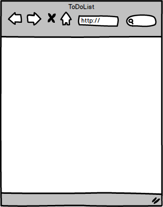

TodoList is web application built to for string to do items.

## Architecture



## Todo Back end

* [Express](https://expressjs.com/)
* [Mongoose](http://mongoosejs.com/)
* [Redis](https://redis.io/)

## Todo Front end

* [React 16](https://reactjs.org/)
* [Reux](https://redux.js.org/)
* [Axios](https://github.com/axios/axios)

## Getting Started

```sh
# clone it
git clone https://github.com/muhzi4u/express-starter.git
cd express-starter

# Make it your own
rm -rf .git && git init && npm init

# Install dependencies
yarn install

# Start  server
yarn run server
```

## ☑ TODO

* [x] Confirm box for delete item
* [ ] Home Page
* [ ] Edit items
* [ ] Change Font
* [ ] Divide active and non-active items
* [ ] Documentation
* [ ] Add PWA support

## License

MIT
