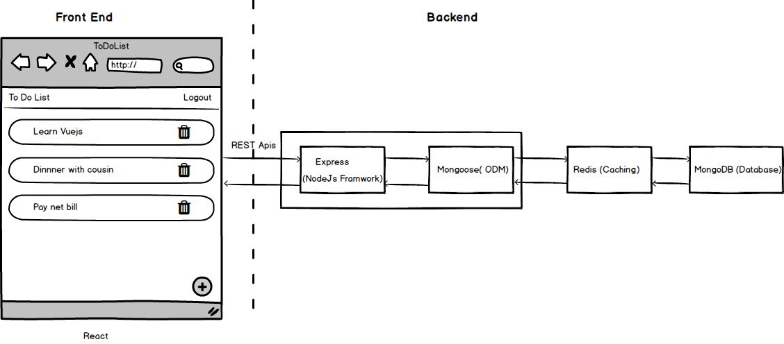

<h1 align="center">
  <br>
  <a href="http://www.amitmerchant.com/electron-markdownify"></a>
  <br>
  To Do List
  <br>
</h1>

<h4 align="center">TodoList is web application built to for storing to do items</h4>


<div align="center">
  Built with ❤︎  
</div>
  

## Architecture



* ### Back end
  * [Express](https://expressjs.com/)
  * [Mongoose](http://mongoosejs.com/)
  * [Redis](https://redis.io/)
* ### Front end
  * [React 16](https://reactjs.org/)
  * [Redux](https://redux.js.org/)
  * [Axios](https://github.com/axios/axios)

## Getting Started

```sh
# clone it
git clone https://github.com/muhzi4u/express-starter.git
cd express-starter

# Make it your own
rm -rf .git && git init && npm init

# Install dependencies
yarn install

# Start  server
yarn run server
```

## Demo

Check out the demo project for a quick example of how NSGIF works. After you capture your video, this is what you have to do, to retrieve the GIF:


## ☑ TODO

* [x] Confirm box for delete item
* [ ] Edit items
* [ ] Movie auth apis to Redux
* [ ] Change Form validation
* [ ] Implement Passport for authentication.
* [ ] Code beautification
* [ ] Divide active and non-active items
* [ ] Documentation
* [ ] CI with Travis
* [ ] Add PWA support

## License

MIT

[](http://forthebadge.com)
